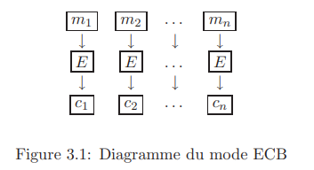

# 3.1.1 Le mode ECB, Electronic Code Book:

Le mode ECB, Electronic Code Book, est le mode le plus simple. Le message $M$ est découpé en blocs , $(m_i)_{i \geq 1}$, et chaque bloc est crypté séparément par

$$c_i = E(m_i)$$

où $E = E_k$ dépend de la clé secrète $k$ et $c_i$ est le bloc crypté correspondant. On procède donc suivant le schéma suivant:

On transmet $c_1 || c_2 || ... ||c_n$.

Un bloc de message $m_i$ sera toujours codé de la même manière, ce qui nuit à la sécurité du codage. D’autre part un attaquant malveillant peut permuter deux blocs ou remplacer un bloc par un autre sans que le destinataire s’en aperçoive. La procédure ECB n’est jamais utilisée en pratique.
