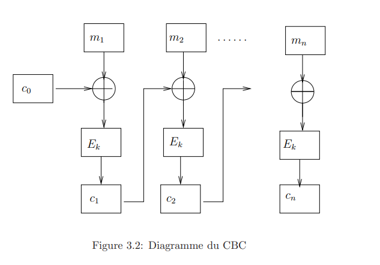

# 3.1.2  Le mode CBC, Cipher Block Chaining:

Le mode CBC, Cipher Block Chaining, a été introduit pour qu’un bloc ne soit pas codé de la mˆeme manière s’il apparaît dans deux messages différents ou s’il apparaît deux fois dans un message.

Le message, $M$, est découpé en blocs , $(m_i)_{i \geq 1}$, et chaque bloc est crypté de la manière suivante. On commence par choisir un bloc initial $c_0$. Chaque bloc clair $m_i$ est d’abord modifié en faisant un XOR de ce bloc avec le bloc crypté précédent, $c_{i−1}$ puis on crypte le résultat obtenu par XORisation avec la clef

$$c_1 = E_k(m_1 \oplus c_0)$$
$$c_2 = E_k(m_2 \oplus c_1)$$
$$ ... $$
$$c_i = E_k(m_i \oplus c_{i-1})$$
$$ ... $$

On transmet le message $c_0 || c_1 || ... || c_n$.

Le bloc initial $c_0$ peut être choisi de l’une des manières suivantes:
1. On génère $c_0$ aléatoirement et on le transmet en clair avec le message
2. On génère $c_0$ aléatoirement et on le transmet de manière confidentielle
3. On utilise un $c_0$ fixe qui fait partie des constantes du cryptosystème
4. On utilise un $c_0$ fixe qui fait partie de la clé sécrète du cryptosystème

On recommande en général d’utiliser l’une des deux première solutions. Les deux dernières font que si le premier bloc est identique dans deux messages différent il sera codé de la même manière ce qui nuit à la sécurité du code.

Le déchiffrement nécessite de connaître la fonction inverse de la fonction de codage $D_k = E^{−1}_k$ pour décrypter

$$m_i = c_{i - 1} \oplus D_k(c_i)$$

Ce système de transmission par blocs a une bonne sécurité et n’affaiblit pas le crytosystème, mais il nécessite de connaître la fonction inverse $D_k$ de $E_k$.