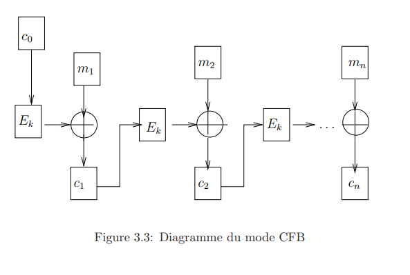

# 3.1.3 Le mode CFB, Cipher FeddBack:

Le mode CFB, Cipher FeedBack, a été introduit pour ne pas avoir à calculer la fonction inverse, $D_k$, de la fonction de chiffrage $E_k$.

Le principe est le même que celui du mode CBC. Le message $M$, est découpé en blocs , $(m_i)_{i \leq 1}$, et chaque bloc est crypté de la manière suivante. On commence par choisir un bloc initial $m_0$, choisi suivant les mêmes principes que le blocs $c_0$ en mode CBC. Chaque bloc clair $m_i$ est XORé avec le crypté du bloc de sortie précédent, $c_{i−1}$, suivant le schéma:

$$c_0 = E_k(m_0)$$
$$c_1 = m_1 \oplus E_k(c_0)$$
$$ ... $$
$$c_i = m_i \oplus E_k(c_{i-1})$$

On transmet le message $c_0 || c_1 || ... || c_n$.

Ce mode est moins sûr que le CBC et est utilisé par exemple pour les cryptages réseaux. L’intérêt est que le déchiffrement ne nécessite pas de calculer $D_k$, en effet:

$$m_i = c_i \oplus E_k(c_{i-1})$$