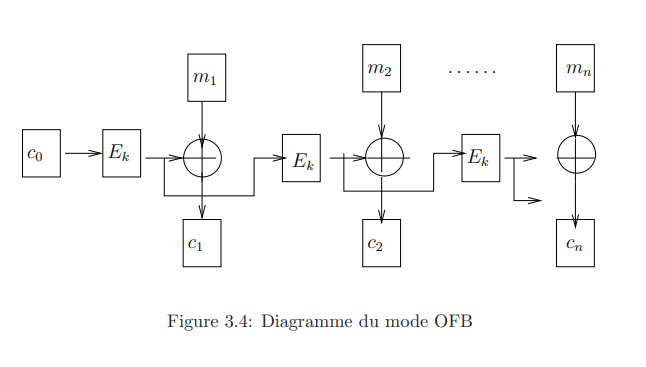

# 3.1.4 Le mode OFB, Output FeedBack:

Le mode OFB, Output FeedBack, est une variante de CFB qui permet d’avoir un cryptage et un décryptage totalement symétrique:

$$z_i = E_k(z_{i-1})$$
$$c_i = m_i \oplus z_i$$

On transmet le message c0||c1|| ... ||cn.
Ce mode est utilisé par exemple pour les cryptages satellites et se déchiffre par

$$z_i = E_k(z_{i-1})$$
$$m_i = c_i \oplus z_i$$

Sa sureté est équivalente à celle du mode CFB.