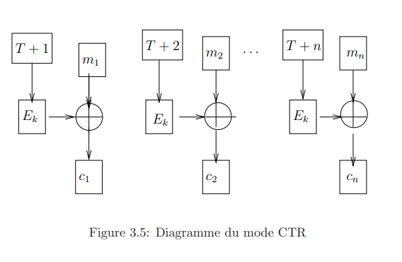

# 3.1.5 Le mode CTR, Counter-mode encryption:

Ce mode de cryptage est lui aussi totalement symétrique, mais en outre facilement parallélisable. Il utilise pour le chiffrement un compteur de valeur initiale $T$:

$$c_i = m_i \oplus E_k(T+i)$$

Le déchiffrage est identique:

$$m_i = c_i \oplus E_k(T+i)$$

L’intérêt d’un tel mode est principalement que les différents calculs de cryptage et décryptage sont indépendants, comme pour le mode ECB, mais qu’un même bloc n’est a priori jamais codé de la même façon.

Sa sureté est équivalente à celle du mode CFB.